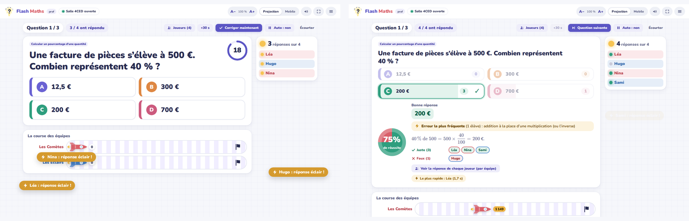
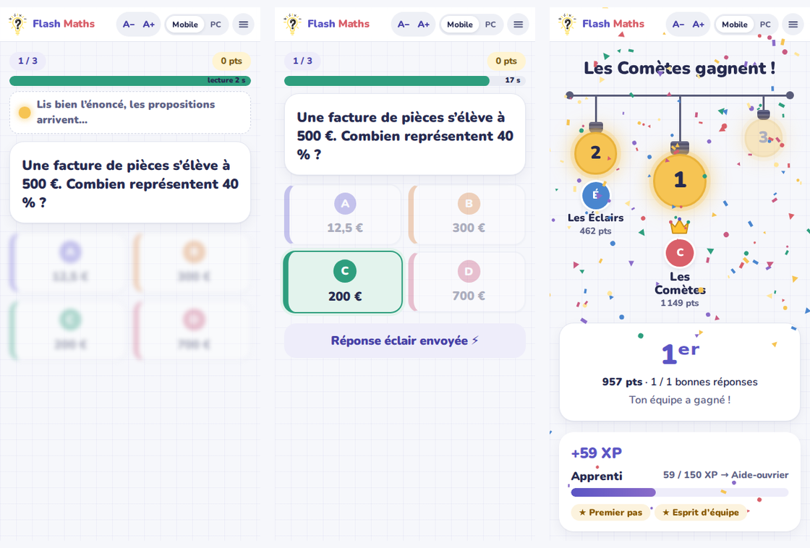

  

<h1 align="center">Flash Maths</h1>

  <b>Des questions flash de mathématiques, en direct au tableau et sur les téléphones.</b> 
  Automatismes, questions de cours et calcul pour le <b>CAP</b>, le <b>Bac Pro</b> et la <b>3ᵉ Prépa-Métiers</b>.

  <a href="https://tom-rougeaud.github.io/flashmaths/"><b>▶ Ouvrir l’application</b></a> ·
  <a href="https://tom-rougeaud.github.io/flashmaths/prof.html">Espace prof</a> ·
  <a href="https://tom-rougeaud.github.io/flashmaths/eleve.html">Espace élève</a>

---

## En bref

Le prof règle la partie, choisit des notions dans le programme de son niveau, vérifie les questions générées puis ouvre une salle. Les élèves la rejoignent sur leur téléphone avec un **code à 4 caractères** (ou un QR code) et leur **prénom**. Trois ampoules s’allument, puis les questions arrivent. Pendant que les élèves répondent, leurs prénoms s’empilent au tableau, sans dévoiler qui a juste. La correction affiche ensuite la répartition des réponses, l’erreur type la plus fréquente et l’explication.

  

  

## Nouveautés de la version 3.5

- **Plein écran automatique** : sur téléphone, tablette, PC et au tableau, la question s’agrandit pour remplir l’écran, sans défilement et sans déformer les figures.
- **Figures plus lisibles** : graduations et légendes ne se chevauchent plus et ne débordent plus des repères.
- **Équipes** : le prof peut renommer une équipe pendant que les élèves arrivent, et son glisser-déposer s’affiche aussitôt au tableau comme sur les téléphones.
- **Tableau élargi** en mode PC, la colonne des prénoms gardant sa largeur.
- **La Classe VS le Prof rééquilibré**, avec des **handicaps du prof** au choix : question affichée 3, 5 ou 10 s plus tard sur son téléphone, erreurs plus coûteuses.

## Nouveautés de la version 3.4

- **Plus de variété** : chaque notion propose plusieurs façons d’être interrogée (calcul direct ou inverse, situation professionnelle, lecture de figure, estimation au curseur, étape fausse, tuiles, remise en ordre). Aucune notion n’a plus une seule forme d’énoncé.
- **Moins de répétitions** : l’application retient les énoncés, les **formes de questions** et les notions déjà jouées. Une deuxième partie sur les mêmes notions change d’angle, pas seulement de nombres.
- **Le programme en arborescence** : niveau › chapitre › sous-chapitre › notion, dans l’ordre des programmes officiels, avec 23 notions nouvelles (fluctuation, quartiles, intérêts simples, marges, inéquations, ensembles et logique, second degré, résolution graphique, cercle trigonométrique, degré 3, exponentielles et logarithme, emprunts, solides et sections…).
- **Nouvelle identité** : propositions repérées par les lettres A B C D, couleurs adoucies, départ et fin de partie en ampoules.
- **Colonne en direct** : les prénoms s’empilent à mesure que les élèves répondent, dans la couleur de leur équipe en Duel.
- **Temps de lecture** (3 ou 5 s, les propositions arrivent après l’énoncé) et **points « justesse seule »** (sans prime de vitesse).

## Fonctionnalités

**Côté prof**
- Réglages en haut de la page, puis le niveau et son programme juste en dessous (une case coche tout un chapitre ou un sous-chapitre), recherche par mot-clé, **Surprends-moi**.
- **Générer** : toutes les questions sont visibles et modifiables avant de jouer (réponses masquées par défaut pour projeter), réordonnables, avec un nouveau tirage question par question.
- **Import de questions** en texte simple : `*` devant la bonne réponse, `= 4,5` pour une saisie libre, tuiles, remise en ordre, estimation.
- Temps de réponse : automatique, 15 s à 5 min, ou un temps propre à chaque notion.
- En jeu : **+30 s**, **Corriger maintenant**, **Écourter**, enchaînement automatique activable à tout moment, réponse de chaque joueur après chaque question.
- QR code en plein écran, fenêtre **Joueurs** (renommer, exclure, retardataire), alerte quand un élève quitte la page du jeu.
- Fin de partie : diagnostic des erreurs types, bilan par élève et par question, exports CSV, historique.

**Trois modes de jeu**

| Mode | Principe | Au tableau |
|---|---|---|
| **Un contre tous** | Chacun joue pour soi | Top 5 en direct, guirlande des 3 meilleurs |
| **Duel d’équipes** | Les élèves glissent leur prénom dans une équipe | Course de fusées, guirlande des équipes |
| **La Classe VS le Prof** | Les bonnes réponses de la classe infligent des dégâts à la jauge de vie du prof, celles du prof (sur son téléphone, avec un handicap au choix) à celle de la classe | Combat avec jauges de vie |

**Côté élève**
- Code, prénom (ou pseudo au hasard), et c’est parti. Les noms grossiers sont refusés.
- QCM, Vrai/Faux, **saisie libre avec clavier virtuel**, **tuiles à associer**, **remise en ordre**, **estimation au curseur**, **étape fausse** à trouver, **figures** (triangles, Thalès, repères, arbres, diagrammes, tableaux, programmes).
- Toutes les écritures équivalentes sont acceptées : `4,5` = `4,50` = `450 %` = `9/2`, et `3x + 2` = `2 + 3x`.
- **Entraînement seul**, même hors connexion, avec un carnet qui repropose les notions à revoir.

**Contenu** : 168 notions (dont 396 questions de cours). Chaque mauvaise réponse correspond à une erreur type, ce qui permet le diagnostic de fin de partie. Les formules sont écrites avec KaTeX.

## Installation (15 minutes, une seule fois)

L’application est faite de pages statiques hébergées sur **GitHub Pages**. Elle s’appuie sur une base **Supabase** gratuite pour les salles en direct.

1. **Supabase** : créez un projet (région Union européenne). Dans *SQL Editor*, collez le contenu de `flash_maths.sql` puis cliquez sur *Run*.
2. **config.js** : collez-y la *Project URL* et la clé publique *publishable / anon* du projet (jamais la clé *secret* ni *service_role*).
3. **GitHub Pages** : *Settings → Pages → Deploy from a branch → main / (root)*.
4. **Vérification** : ouvrez `prof.html`, puis menu ☰ → *Diagnostic de la base*. Les trois lignes doivent être vertes.

Le pas à pas détaillé, avec le dépannage, se trouve dans la notice PDF fournie avec l’application (à garder pour soi, à ne pas publier ici).

## Fichiers du dépôt

| Fichier | Rôle |
|---|---|
| `index.html` | Accueil : « Je suis prof » / « Je suis élève » |
| `prof.html` | Espace prof : régler, choisir, vérifier, ouvrir la salle, jouer, bilans |
| `eleve.html` | Espace élève : code, prénom, jeu, entraînement, carnet |
| `contact.html`, `confidentialite.html` | Contact et confidentialité |
| `config.js` | Adresse et clé publique de la base Supabase |
| `flash_maths.sql` | Script de la base (version 4) |
| `source/` | Code source : `src/` (à assembler avec `build.py`), banque de questions, programme, tests automatiques |

Chaque page HTML est autonome : polices, formules (KaTeX), QR code et client Supabase sont intégrés. Aucun CDN, aucune police externe, aucun traceur.

## Confidentialité

- La base ne contient que les codes de salle et les prénoms ou pseudos (effacés 4 h après la dernière activité) et les bilans des parties (effacés après 30 jours). Aucune adresse e-mail, aucun nom de famille.
- Les réponses des élèves passent en direct et ne sont jamais enregistrées dans la base.
- Le carnet de l’élève et les questions du prof restent dans le navigateur de l’appareil.

## Licence

Outil libre **CC BY-NC 4.0** : vous pouvez l’utiliser, le copier et l’adapter en citant l’auteur, sans usage commercial.
